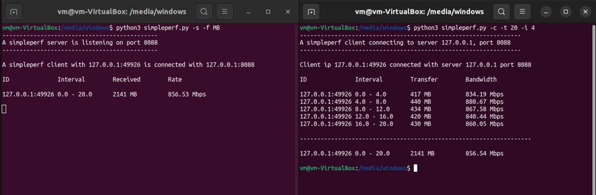
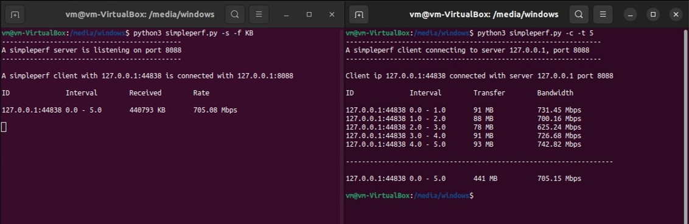
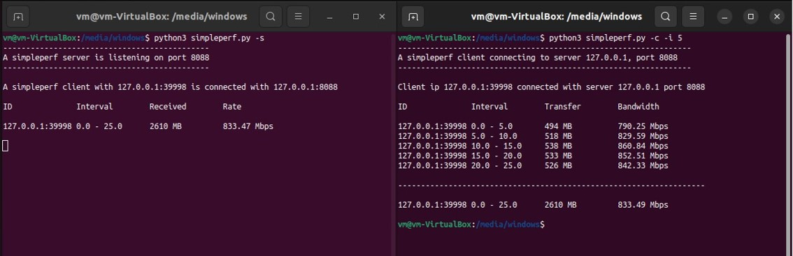
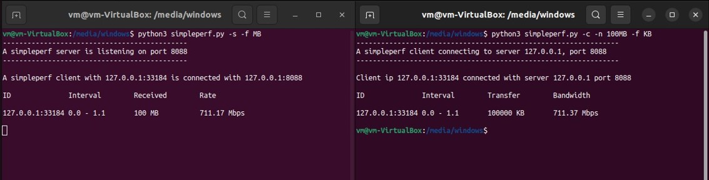
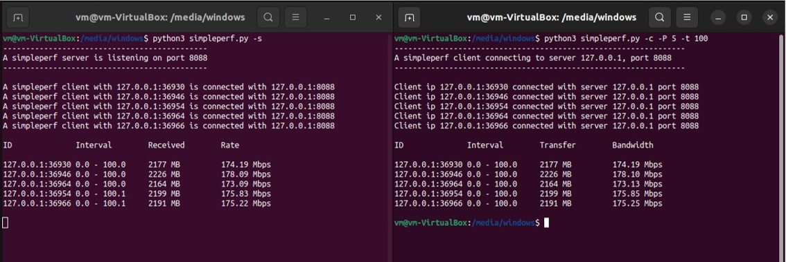

# SIMPLEPERF

## Overview

**Simpleperf** is a tool for measuring network performance by generating traffic between two endpoints. It is a simplified version of iperf, a tool used to test the throughput and bandwidth in a network. **Simpleperf** runs in two modes: **_server mode_** and **_client mode_**

## Prerequisites

Make sure you have the following installed before getting started:

-   python3 (verify with `python3 --version`)
-   pip (verify with `pip --version`)
-   mininet (verify with `sudo mn --version`)
-   xterm (verify with `xterm -version`)
-   openvswitch-testcontroller (verify with `which testcontroller`)

## Installation

If you don't have any of the dependencies installed, you can install them by running the following commands in the terminal:

```
$ sudo apt install python3-pip
$ pip install mininet
$ sudo apt-get install mininet
$ sudo apt-get install xterm
$ sudo apt-get install -y openvswitch-testcontroller
```

To run the program, first make sure the necessary ports are available. You can do this by running the following commands:

```
$ sudo mn -c
$ sudo fuser -k 6653/tcp
```

## Server mode

When you run in server mode, **simpleperf** will receive TCP packets and track how much data was received during from the connected clients; it will calculate and display the bandwidth based on how much data was received and how much time elapsed during the connection. Server mode reads data in chunks of 1000 bytes where we assume that 1 KB = 1000 Bytes.

To run **simpleperf** in server mode with the default options, it must be invoked as follows:

```
$ python3 simpleperf -s
```

Where `-s` indicates **simpleperf** is running in a server mode.

The server prints following and wait for a connection:

```
---------------------------------------------
A simpleperf server is listening on port XXXX
---------------------------------------------
```

When a client connects, server prints the following:

```
---------------------------------------------
A simpleperf server is listening on port XXXX
---------------------------------------------

A simpleperf client with <IP address: port> is connected with <server IP:port>
```

At the end of the transfer, server prints the the results of measurements and close the connection.

```
---------------------------------------------
A simpleperf server is listening on port XXXX
---------------------------------------------

A simpleperf client with <IP address: port> is connected with <server IP:port>

ID          Interval    Received    Rate

IP:port     0.0 - 25.0  X MB        Y Mbps
```

There are four columns here:

1. _ID_ specifies the _client_IP:port_ pair
2. _Interval:_ Total duration in seconds
3. _Transfer:_ The total number of bytes received (in Megabytes, if not specified with `-f`)
4. _Rate:_ The rate at which traffic could be read in megabits per second (Mbps).

Table below lists all the available options that you can use to invoke the server:

| <div style="width: 50px">**Flag**</div> | <div style="width: 75px">**Long flag**</div> | <div style="width: 90px">**Input**</div> | <div style="width: 50px">**Type**</div> | <div style="width: 100px">**Description**</div>                                                                                                       |
| --------------------------------------- | -------------------------------------------- | ---------------------------------------- | --------------------------------------- | ----------------------------------------------------------------------------------------------------------------------------------------------------- |
| `-s`                                    | `--server`                                   | **X**                                    | boolean                                 | enable the server mode.                                                                                                                               |
| `-b`                                    | `--bind`                                     | **ip address**                           | string                                  | allows to select the **ip address** of the server's interface where the client should connect. _Default_: `127.0.0.1`                                 |
| `-P`                                    | `--port`                                     | **port num**                             | integer                                 | allows to use select **port number** on which the server should listen; the port must be an integer and in the range [1024, 65535]. _Default_: `8088` |
| `-f`                                    | `--format`                                   | **MB**                                   | string                                  | allows to choose the format of the summary of results - it must be either in B, KB or MB, _Default_: `MB`                                             |

## Client mode

When you run **simpleperf** in a client mode, it establish a TCP connection with the **simpleperf** server and send data in chunks of 1000 bytes for t seconds specified with `-t` flag. **Simpleperf** calculate and display the bandwidth based on how much data was sent in the elapsed time.

To operate **simpleperf** in client mode, it must be invoked as follows:

```
$ python3 simpleperf -c -I <server_ip> -p <server_port> -t <time>
```

Where:

• `-c` indicates this is the **simpleperf** client mode.
• `-I` specifies the **server_ip** - IP address of the **simpleperf** server will receive data from the **simpleperf** client
• `-p` specifies the **server_port** in which the server is listening to receive data; the port is in the range [1024, 65535]
• `-t` is the total duration in seconds for which data is generated and sent to the server.

The client prints the following:

```
--------------------------------------------------------
A simpleperf client connecting to server <IP>, port XXXX
--------------------------------------------------------

Client connected with server_IP port XXXX

ID          Interval    Transfer    Bandwidth

IP:port     0.0 - 25.0  X MB        Y Mbps
```

Table below lists all the available options that you can use to invoke the server:

| <div style="width: 50px">**Flag**</div> | <div style="width: 75px">**Long flag**</div> | <div style="width: 90px">**Input**</div> | <div style="width: 50px">**Type**</div> | <div style="width: 100px">**Description**</div>                                                                                                       |
| --------------------------------------- | -------------------------------------------- | ---------------------------------------- | --------------------------------------- | ----------------------------------------------------------------------------------------------------------------------------------------------------- |
| `-c`                                    | `--client`                                   | **X**                                    | boolean                                 | enable the client mode.                                                                                                                               |
| `-I`                                    | `--serverip`                                 | **ip address**                           | string                                  | allows to select the **ip address** of the server's interface where the client should connect. _Default_: `127.0.0.1` 2                               |
| `-p`                                    | `--port`                                     | **port num**                             | integer                                 | allows to use select **port number** on which the server should listen; the port must be an integer and in the range [1024, 65535]. _Default_: `8088` |
| `-t`                                    | `--time`                                     | **seconds**                              | integer                                 | allow to set the total duration in seconds for which data is generated and sent to the server.                                                        |
| `-f`                                    | `--format`                                   | **MB**                                   | string                                  | allows to choose the format of the summary of results - it must be either in B, KB or MB, _Default_: `MB`                                             |
| `-i`                                    | `--interval`                                 | **z**                                    | integer                                 | allow to print statistics per `z` seconds.                                                                                                            |
| `-P`                                    | `--parallel`                                 | **no_of_conn**                           | integer                                 | allow to create parallel connections to connect to the server and send data. It must be 1 and max value must be 5. _Default_: 1                       |
| `-n`                                    | `--num`                                      | **no_if_bytes**                          | string                                  | allow to transfer number of bytes, it must be either in B, KB or MB.                                                                                  |

## Execution examples










